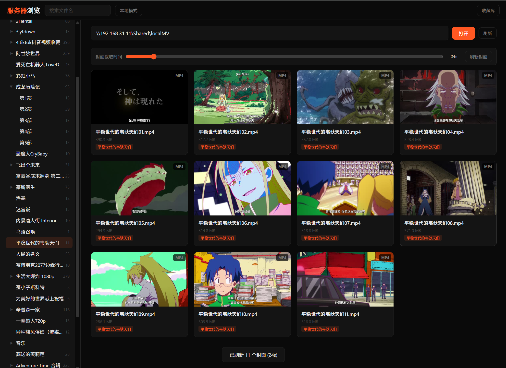
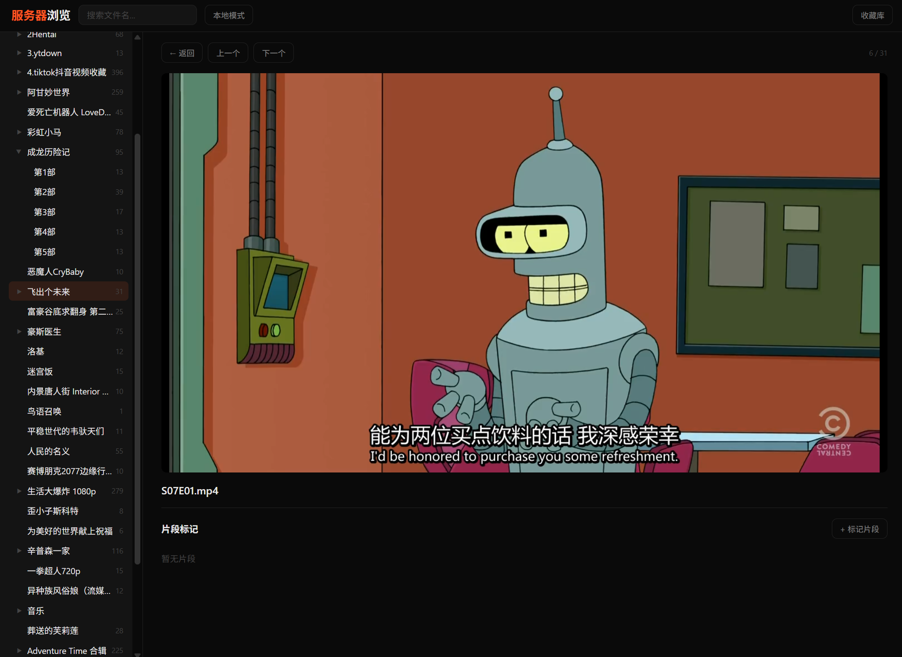

# Tricks Collection

**Video Library Browser** — 基于 Web 的本地视频浏览器，文件夹树导航、缩略图生成、片段标记剪辑、快捷键驱动。

## 提示
⚠️
警告，安全风险提示  
程序未经安全审计，建议仅在本地使用。  
可能存在安全漏洞，在服务器上运行时请做好安全组配置。

## 安装

需要 Node.js 和 ffmpeg（用于生成缩略图）。

```bash
npm install
npm start
```

默认端口 3000，浏览器打开 <http://localhost:3000>。

自定义端口：

```bash
node server.js 6688
# 或
PORT=6688 npm start
```


## 三个页面

- **首页** (`/`) — 精选技巧收藏，上传视频、分类管理、标记精彩片段
- **本地浏览** (`/local.html`) — 直接浏览本地文件夹（需 Chromium 内核浏览器，使用 File System Access API）
- **服务器浏览** (`/server.html`) — 通过服务器浏览指定路径的视频文件夹

## 白名单配置

在 `data/` 目录下创建 `whitelist.txt` 可限制服务器模式允许访问的目录，每行一个路径：

```
D:\Videos
\\192.168.1.1\Share\movies
/home/user/media
```

- 没有 `whitelist.txt` 时，可输入任意路径（默认行为）
- 有白名单时，页面会显示可选目录按钮，只能访问列表中的目录及其子目录
- 以 `#` 开头的行为注释
- 手动输入非白名单路径会被服务器拒绝（403）
- 启动时控制台会打印当前白名单状态

## 快捷键

在视频详情页（播放界面）可用：

| 按键 | 功能 |
|------|------|
| `↑` `↓` | 上一个 / 下一个视频 |
| `Esc` | 返回列表 |
| `f` | 切换全屏 |
| `r` | 重命名当前视频 |
| `Delete` | 删除当前视频 |
| `z` | 收藏 / 取消收藏（文件名加/去 `-[stared]` 后缀） |

片段标记（片段面板打开时）：

| 按键 | 功能 |
|------|------|
| `a` | 标记起点 |
| `b` | 标记终点 |

## 其他操作

- **拖拽移动** — 把视频卡片拖到左侧文件夹树即可移动；详情页也可拖拽文件名旁的文件图标到文件夹
- **右键菜单** — 文件夹右键可新建、重命名、删除；视频卡片右键可重命名、删除
- **缩略图** — 拖动滑块选择截图时间点，点击刷新封面批量更新
- **片段剪辑** — 标记起点终点后可预览或保存为新片段

## 收藏约定

按 `z` 收藏视频时，文件名会被加上 `-[stared]` 后缀（如 `trick.mp4` → `trick-[stared].mp4`），再按一次取消。

## 预览截图






## todo
